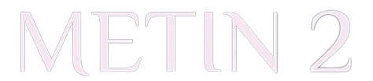
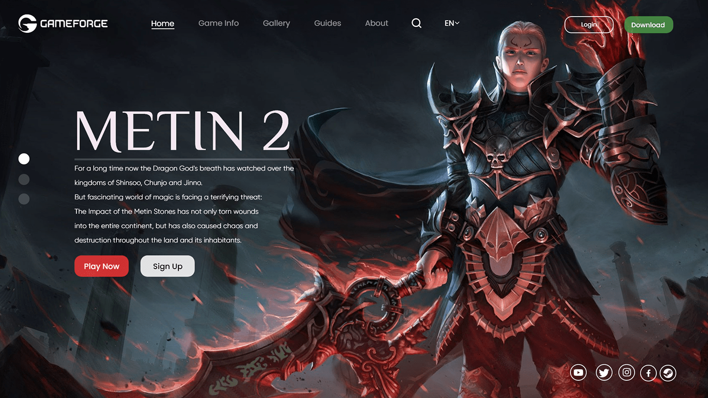

<h1 align="center">Project: Metin2</h1>

<p align="center">
  
</p>

Welcome to the Metin2 project! This initiative aims to carry out a redesign inspired by an exceptional profile found on Behance. Our mission is to elevate aesthetics and functionality, providing an engaging and innovative digital experience for users.

<p align="center">
  <a href="#-tecnologias">Technologies</a>&nbsp;&nbsp;&nbsp;|&nbsp;&nbsp;&nbsp;
  <a href="#-projeto">Project</a>&nbsp;&nbsp;&nbsp;|&nbsp;&nbsp;&nbsp;
  <a href="#-layout">Layout</a>&nbsp;&nbsp;&nbsp;|&nbsp;&nbsp;&nbsp;
  <a href="#-license">License</a>
</p>

## 🔗 Links

[](https://instagram.com/davidalmeidadev)
[](https://instagram.com/davidalmeidadev)
[](https://react-project-portfolio.vercel.app/)
[](./LICENSE)

## 🚀 Tecnologies

This project was developed with the following technologies:

- HTML5, CSS3, JS ES6+
- [Node e Yarn](https://nodejs.org/)
- [Next.js](https://nextjs.org/docs)
- [React Icons](https://www.npmjs.com/package/react-icons)
- [Typescript](https://www.typescriptlang.org/docs/)
- [Tailwind CSS](https://sass-lang.com/documentation/)

## 💻 Project

The Metin2 project represents an ambitious redesign initiative, driven by inspiration found in a notable [Behance profile](https://www.behance.net/omerhan). Our goal is to redefine the digital experience by incorporating fundamental concepts of usability, user-centered design, and visually captivating aesthetics. Through the application of cutting-edge technologies such as React for modular construction, Next.js for efficient rendering, and Tailwind CSS for a utilitarian approach to design, we aim to deliver not only attractive aesthetics but also agile and responsive performance.

The redesign process not only aesthetically enhances our design, but is a dynamic response to growing user expectations in the digital age. Modernization not only delights visually, but also translates into an improved user experience, promoting satisfaction and loyalty. Furthermore, we recognize the strategic importance of redesign in maintaining competitive relevance and continued commitment to innovation. By inviting users to explore a renewed digital environment, we are building an experience that resonates with constant progress and inspires more meaningful interaction.

## 🏡 Get started

Installing project dependencies

```sh
yarn install
```

Application initialization

```sh
yarn dev
```

Application build

```sh
yarn build
```

## 🔖 Layout

You can view the project layout by clicking [here](https://www.behance.net/gallery/108536263/Metin2-Redesign-Project).

<p align="center">
  
</p>

## 📝 License

This project is under the [MIT license](./LICENSE).
